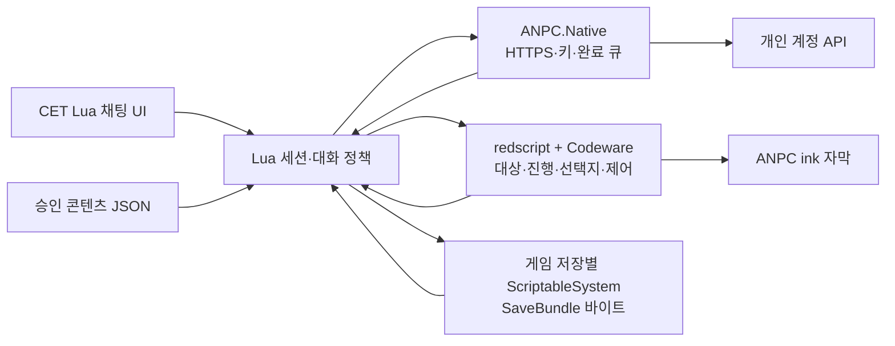

# ANPC 첫 게임 모드 구현 계획

설계 기준: 2026-10-04. 도구 근거·설치 후보 버전은 [모딩 도구 조사](mod-tooling-research.md)를 따른다. 첫 대상은 Windows x64의 사이버펑크 2077이다. 실제 2.31 설치에서 G0/G1·G2 후보를 설치·실행했으며 수용 시험을 통과한 조합만 지원으로 확정한다. 이 문서는 구현 계획이며 실제 구현·검증 상태는 12절과 [게임 검증 기록](game-mod-validation.md)을 따른다.

## 1. 개발 범위와 도구 구성

첫 개발 묶음은 재키의 습격 전 자유 구간·빅터의 진료소 자유 구간·군중 원형 하나다. 재키의 사망 이후 차단, 빅터의 상환/렐릭 진단 분리, 군중 소멸/재접촉을 함께 시험한다. 12명 일괄 활성화는 해당 인물의 식별·진행·선택지·제어·콘텐츠 검수 뒤에 진행한다.

| 구분 | 도구/구성 | 역할 |
| --- | --- | --- |
| 필수 런타임 | RED4ext·redscript·CET·Codeware | 게임 스크립트·Lua/ImGui·수명/ink 연결 |
| 개발 도구 | WolvenKit·VS Code/Redscript IDE·NativeDB | 자산/스크립트 조사·타입 확인·편집 |
| 선택 개발 도구 | 호환이 확인된 Red Hot Tools | 엔티티/선택지 UI 검사·제한된 핫 리로드 |
| 네트워크 실증 도구 | RedHttpClient, 필요 시 RedData·RedFileSystem | 비동기 HTTPS 경로 검증. 해당 실증 단계에만 설치 |
| 제품용 자체 플러그인 | ANPC.Native.dll: RED4ext.SDK·CMake·MSVC x64 | WinHTTP·Windows 키 보관·UTF-8/바이트·해시·전역 비용 원장 |

ANPC.Native는 새로 구현할 작은 로컬 DLL이다. 별도 서버·프로세스·C# 런타임을 추가하지 않는다. REDmod·ArchiveXL·TweakXL·AMM은 첫 필수 의존성에 넣지 않는다. 필요 자산/제스처를 후속으로 연결할 때 해당 도구의 지원 조합을 추가한다.

## 2. 실행 구조

| 계층 | 구현 책임 | 수명 |
| --- | --- | --- |
| CET Lua | UI·입력·공통 계약 검사·콘텐츠/지식 선별·프롬프트·세션 요약 | 모드 로드 후, 각 세션/세계 세대로 작업 격리 |
| redscript | 실제 대상 참조·상태 수집·원작 선택지 전환·기본 제어·자막·저장 앵커 | 게임 세션별 ScriptableSystem·살아 있는 객체 |
| Codeware | 게임/엔티티/입력 이벤트·ink 접근 | 콜백 범위 지정. 게임 종료 때 참조 해제 |
| ANPC.Native | HTTPS 전송·키 참조 해석·취소·제한 시간·완료 보관·문자/해시·원장 I/O | 프로세스 수명. 게임 객체와 Lua 상태에 작업 스레드가 접근하지 않음 |

대화 정책은 Lua가 소유하고 실제 게임값과 제어는 redscript가 소유한다. 두 언어에서 퀘스트/기억 규칙을 따로 구현하지 않는다. 기존 JavaScript 시제품의 JSON 콘텐츠·베이스·스키마·가상 예시는 재사용하고 JS 엔진/Node 서버를 게임에 넣지 않는다. 정책 구현은 Lua로 옮기며 같은 공통 예시로 동작을 비교한다.

초기 HUD는 원작 자막을 덮어쓰지 않는 ANPC 소유 ink 위젯이다. 화자·확정 대사·종료 처리는 [자막 계약](runtime-specification.md#7-대사-자막과-게임-진행)을 따른다. 기본 ImGui 입력창과 ink 자막을 먼저 완성하고 화면 디자인은 그 위에서 조정한다.

## 3. 모듈 포트 연결

형식은 `contracts/v1/`을 사용한다. 아래는 구현 배치이며 새로운 데이터 타입/공통 포트를 정의하지 않는다. 구현 완료 시 ModuleManifest/ModulePlan의 game 구성을 작성한다.

| 기존 포트 | 게임판 구현 |
| --- | --- |
| TargetResolver.resolve·StateCollector.collect | redscript 수집기 → Lua 공통 Envelope |
| IdentityResolver.resolve·PersonaProjector.project·KnowledgeSelector.select | Lua의 승인 카드·진행/인지 정책 |
| MemoryStore.*·MemorySelector.select | Lua 작업 기억 + redscript의 게임 저장별 묶음 |
| SessionSummarizer.propose·MemoryStore.commitSession | 세션 전체 한 줄 정리. 선택 유료 모델 실패 시 로컬 기록 |
| PromptAssembler.assemble·ReplyValidator.validate | Lua 공통 스키마/인지/행동 검증 |
| Provider.generate | Lua 제공자 변환 → Native HTTPS → ProviderResult |
| ActionCatalog.describe·ActionSelector.select·ActionAdapter.* | Lua 후보/권한 검사 + redscript 실제 기본 제어 |

원작 선택지 진입·UI·세션 종료는 호스트 수명 절차다. 새 교환 포트가 필요하면 공통 등록표·스키마·예시를 함께 개정한다. simulation 수집기·가짜 행동·개발용 draft 콘텐츠를 game 구성의 정상 자료로 연결하지 않는다.

## 4. 게임 대상과 퀘스트 매핑

- 시선 대상 후보는 TargetingSystem.GetLookAtObject에서 얻고 NPC 타입·동일 객체·거리·사망·전투·원작 제어를 재검사한다. 현재 후보 API의 시그니처는 실제 설치 빌드에서 확인한다.
- 군중 키는 살아 있는 참조와 인스턴스/세계 세대로 만든다. 공통 레코드 ID나 표시 이름을 개인 키로 사용하지 않는다.
- 고유 인물은 레코드·엔티티/장면 단서·현재 진행을 대조한 명시적 매핑으로 character_key를 부여한다. 이름 번역이나 외형만으로 재키/빅터/소미를 판정하지 않는다.
- 개발용 진단에는 필요한 ID·판정 사유만 표시한다. 키·대화 원문·전체 상태 덤프는 기본 로그에 넣지 않는다.
- 현재 위치·아이템·복장·공개 평판은 확인된 값만 ObservationView로 투영한다. 복장 수집 성공이 별도 장기 관찰 기록을 만들지 않는다.

게임 매핑 자료는 실제 필드마다 API/원작 fact 또는 journal 경로·변환·지원 빌드·전후 저장 증거를 기록한다. 형태는 공통 [필드 등록표](../contracts/v1/cyberpunk2077-fields.json)의 의미와 맞춰 승인한다. 미검증 82개 후보에는 값을 추정해 채우지 않는다.

| 첫 매핑 | 확인할 저장/장면 | 요구 결과 |
| --- | --- | --- |
| 재키·습격 전/사망 | 초반 자유 접촉·습격 장면·사망 이후 | 자유 구간만 허용. 원작 장면·사망에서 종료/차단 |
| 빅터·상환/진단 | 진단 전 상환·미상환·진단 후 | 상환이 미래 렐릭 진단을 부여하지 않음 |
| 군중 원형 하나 | 거리 이탈·재접촉·언로드·로드 | 동일 유효 인스턴스만 기억·성격 유지 |

JournalManager/QuestTracker 이벤트로 변경을 감지하고 요청 직전·수용 직전에 다시 수집한다. 일지 등록만으로 장면 진입·완료·연애·인지·현재 위치를 확정하지 않는다. 조니의 렐릭 접촉과 소미의 원격/장면 접촉은 후속 인물별 매핑 단계에서 따로 연결한다.

## 5. 원작 선택지와 입력 소유

커뮤니티는 기존 선택지 아래 추가 항목, 군중은 원작 기본 반응 뒤 추가 항목을 제공한다. 추가 항목 수용 후에만 원작 제어 반환과 대화 조건을 재검사하고 AI 세션을 연다.

| 작업 | 확인할 구현/경계 |
| --- | --- |
| 선택지 UI 조사 | Ink Inspector·디컴파일 코드로 실제 DialogChoiceHubs·렌더러·선택 이벤트의 소유자 확인 |
| 추가 항목 | 기존 항목/ID/기본 반응을 유지하고 ANPC 소유 항목 하나만 생성. 재렌더링 중복 없음 |
| 선택 수용 | ANPC 항목만 호스트로 전달하고 원작 선택 실행을 중복 호출하지 않음 |
| handoff | 원작 제어가 끝나고 대상/진행/거리/안전 재검사를 통과해야 active |
| 입력 포커스 | 입력 중 Enter·문자·선택 키의 게임 중복 실행 차단. Esc/취소/종료는 명시 처리 |
| 종료/변경 | ANPC 입력 점유·위젯·콜백만 해제. 오래된 원작 선택 목록을 현재 상태 위에 복사하지 않음 |

InteractionUIBase.OnDialogsData는 조사 시작점이며 삽입/선택 이벤트의 확정 API는 아니다. Real Talk의 원작 선택 목록 전체 비우기를 그대로 적용하지 않는다. 아직 안전한 선택지 삽입을 확인하지 못한 구간은 지원 목록에서 제외한다.

초기 개발 핫키는 수집기/모의 대사 계측용이다. 핫키로 채팅이 열렸다는 결과만으로 첫 게임판의 추가 선택지 요구를 완료 처리하지 않는다. 게임 시간 정지·원작 대화 강제 종료·원작 명령 일괄 취소를 진입 수단으로 사용하지 않는다. 커뮤니티 원작 허브는 [식별 규격](npc-identity-specification.md) 2.1의 보류 예외로 처리한다. 장면 시스템 스크립트 API에는 장면 종료·중단 기능이 없다.

## 6. 기본 제어와 종료

지원 후보는 AIHoldPositionCommand·LookAtAddEvent/RemoveEvent다. 인물·장면별 실행/해제를 시험하고 [행동 규격](npc-action-scope.md)의 기본 제어 4종만 처음 execute로 활성화한다. 추가 제스처는 selection_only다.

- 각 제어의 ANPC 소유 핸들을 보관하고 종료 때 해당 핸들만 해제한다. 게임/타 모드 명령은 유지한다.
- 요청 중 전투·사망·장면 시작·거리 이탈·언로드·빠른 이동·로드가 발생하면 세대를 올리고 대사·행동·요약의 늦은 결과를 폐기한다.
- 작업 스레드는 게임 객체를 참조하지 않는다. Native 완료는 CET onUpdate에서 읽고 현재 Fence·대상·상태를 검사한 뒤 게임 측에 적용한다.
- UI/스크립트 재로드·프로세스 종료도 정리 대상이다. 객체가 사라진 뒤에는 해제 메서드를 호출하지 않는다.
- 로드 이후 입력 점유·정지·시선·자막이 남으면 해당 어댑터를 지원으로 등록하지 않는다.

## 7. 개인 API 키와 통신

첫 제공자는 기존 OpenAI Responses 변환을 포팅한다. 모델은 사용자가 선택하고 검수한 지원 프로필로 고정한다. Codex 로그인 실행기·로컬 모델·음성은 첫 게임판 연결에 필수로 넣지 않는다.

| 경계 | 제품 구현 |
| --- | --- |
| 키 등록/삭제 | Native의 Credential Manager. UI는 등록 결과·마스킹만 표시. 저장 실패 시 실행 메모리 사용을 안내 |
| 호출 | Lua는 모델 입력과 credential_ref를 전달. Native가 키를 해석해 HTTPS 인증 헤더 구성 |
| 전송 | 정상 인증서 검증·등록된 HTTPS endpoint_profile. 리디렉션으로 인증 헤더를 다른 호스트에 전달하지 않음 |
| 제한 시간 | 연결/수신 제한과 전체 마감 시간. 표준 기본 15초 및 사용자 설정 범위 적용 |
| 취소 | Native 요청 핸들 종료 + Fence 폐기. 취소가 이미 사용한 API 토큰의 미청구를 보장하지 않음 |
| 완료 | 스레드 안전 큐 → 게임 업데이트. 늦은 결과는 표시·행동·기억에 반영하지 않음 |
| 진단/원장 | 요청 상태·시간·usage·비용만. 키/헤더/원문 로그 없음. 게임 로드로 원장을 되돌리지 않음 |

RedHttpClient는 제한된 비동기 HTTPS 실증에 사용할 수 있다. logging=false와 실제 로그 비노출을 먼저 확인한다. 공개 인터페이스의 취소/timeout/콜백 스레드 제약이 남아 있어 제품 어댑터의 완료를 대신하지 않는다. 게임 구성에는 실증용과 제품용 통신을 동시에 연결하지 않는다.

ANPC.Native의 export/RTTI·호출 ABI는 RED4ext.SDK 템플릿에 맞춰 작성한다. WinHTTP 콜백 종료와 플러그인 unload의 경합을 Windows 테스트로 검증한다. 게임 타입을 임의 포인터/오프셋으로 접근하는 HTTP DLL을 만들지 않는다.

## 8. 게임 저장에 묶인 단순 기억

기억 정책은 [세션 한 줄 규격](memory-specification.md) 그대로다. 저장 구현을 이유로 세부 사실·복장·약속·중요도 정책을 추가하지 않는다.

| 자료 | 저장 위치/범위 |
| --- | --- |
| 완료 요약·진행 중 수용 발화 | Lua 작업 기억. 저장 시 공통 SaveBundle로 캡처 |
| 저장별 기억 묶음 | redscript ScriptableSystem의 persistent Uint8 배열에 SaveBundle UTF-8 JSON 바이트 |
| 회차·체크포인트 식별자 | 같은 시스템의 persistent 숫자 배열. 문자열 참조는 호스트가 변환 |
| 군중 기억 | 실행 메모리만. 게임 저장에 승계하지 않음 |
| 키 | Windows Credential Manager 또는 실행 메모리. 게임 저장·묶음에 포함하지 않음 |
| 비용·설정 | Native의 사용자별 로컬 전역 파일. 게임 저장과 독립 |

1. Session/BeforeSave에서 완료 요약과 진행 중 발화를 불변 스냅샷으로 잡는다. 호스트 발급 회차/체크포인트로 game_save_ref를 만들고 같은 식별자를 숫자 앵커에 넣는다. UTF-8 변환·스키마·digest 검사 후 persistent 바이트 배열을 교체한다. 모델 요약 완료를 기다리거나 추가 호출하지 않는다.
2. 게임 자체 직렬화가 그 앵커와 묶음을 함께 저장한다. 현재 작업 기억과 비동기 요약이 변해도 저장용 배열은 다음 저장 준비 전까지 수정하지 않는다. BeforeSave/직렬화/AfterSave의 실제 순서와 중첩 저장을 시험한다. AfterSave만으로 슬롯 이름·성공 여부를 추정하지 않는다.
3. OnRestored에서 복원된 앵커와 묶음의 game_save_ref·범위·버전·digest를 검사한다. 당시 자료로 완전히 교체하고 이전 작업·군중 참조·UI/제어를 폐기한다. 자료가 없거나 맞지 않으면 빈 기억과 안내다.

String의 persistent 지원은 없으므로 문자열 필드를 그대로 쓰지 않는다. Primitive Uint8 배열·UUID 숫자 표현·한글 UTF-8 변환·전체 묶음의 크기/성능·스크립트 개정/모드 제거가 실게임 시험을 통과해야 이 저장 구현을 활성화한다. 실패하면 저장별 기억 지원은 보류하고 별도 저장 방식의 설계/공통 어댑터를 다시 검토한다. 임의 슬롯 파일명이나 가장 최근 전역 기억으로 대체하지 않는다.

## 9. 소스와 설치 구조

아래는 소스 디렉터리와 배포 대응이다. G0/G1의 `game/cet/anpc/`·`game/redscript/ANPC/` 소스는 작성했으며 나머지는 구현 계획이다. 설치·실게임 검증 상태는 [G0/G1 기록](game-mod-validation.md)을 따른다.

| 소스 계획 | 배포 위치 |
| --- | --- |
| game/cet/anpc/init.lua·ui/·policies/·adapters/ | bin/x64/plugins/cyber_engine_tweaks/mods/anpc/ |
| game/redscript/ANPC/ | r6/scripts/ANPC/ |
| game/native/·CMakeLists.txt | red4ext/plugins/ANPC.Native/ANPC.Native.dll |
| game/content/ 승인 자료·베이스·계약 검사기 | CET anpc/content/·contracts/ 아래. CET의 모드별 파일 접근 범위 준수 |
| game/profiles/ 지원 매핑·모듈 구성 | CET anpc/profiles/ 아래 |
| 로컬 사용자 설정·원장 | %LOCALAPPDATA%/ANPC/Cyberpunk2077/ |
| 후속 신규 자산 | 선택 배포. archive/pc/mod 또는 REDmod 패키지 중 실제 사용 방식 지정 |

배포 도구는 ANPC 소유 파일 목록으로 복사/삭제하고 사용자 키·원장·다른 모드 파일·게임 원본은 건드리지 않는다. 도구 의존성은 제작자 배포에서 설치하고 ANPC ZIP에 임의 재배포하지 않는다. 게임 경로·개인 키·로컬 설정·게임 원본/디컴파일 결과는 Git에 넣지 않는다.

## 10. 설치와 개발 절차

1. Windows 게임 설치 경로·패치·확장 유무·기존 코어 모드 버전을 기록한다. 별도 시험 프로필과 전후 저장을 준비한다.
2. RED4ext → redscript/CET → Codeware를 후보 버전으로 설치한다. 추가 도구는 해당 제작자의 의존성 순서를 따른다. 한 단계마다 시작/종료·로그·기존 저장 로드를 확인한다.
3. VS Code의 Redscript IDE에 게임 경로와 스크립트 폴더를 연결한다. WolvenKit에서 같은 설치의 자산·일지/장면 후보를 조사한다. .NET/VC++ 요구는 설치한 릴리스 기준으로 맞춘다.
4. 호환이 확인된 Red Hot Tools로 실제 대상·선택지 UI를 검사한다. 타입·persistent 필드·수명 구조 변경 뒤에는 핫 리로드 대신 게임을 다시 시작한다.
5. API 없이 진단 UI·모의 대사·추가 선택지·제어 복구를 완성한다. 네트워크 실증과 제품 Native 어댑터는 이 경계를 통과한 뒤 연결한다.

읽을 로그는 RED4ext·redscript_rCURRENT·CET·ANPC 오류/사용량이다. 성공 판정에 키·발화·게임 전체 상태 덤프가 필요하지 않도록 진단 항목을 제한한다.

## 11. 구현 순서와 수용 조건

| 단계 | 구현 산출물 | 게임에서 통과할 조건 |
| --- | --- | --- |
| G0 | 도구 설치·최소 Lua/redscript 로더·버전 표시 | 컴파일 오류 없음, 게임 시작/종료·기존 저장 정상 |
| G1 | 대상/상태 읽기 진단·모의 대사 | 동일 객체·거리·원작 장면 차단. 게임 상태 변경 없음 |
| G2 | 기존 선택지 아래 ANPC 항목·군중 기본 반응·입력 소유 | 원작 선택 유지, 중복 실행 없음, handoff 후에만 시작 |
| G3 | 정지/시선·자막·종료/취소/위험 정리 | 전투·이탈·장면·소멸·로드 후 제어/위젯 잔류 없음 |
| G4 | 저장별 앵커/바이트 묶음·한 줄 기록 | 수동/빠른/자동 저장·슬롯 덮어쓰기·과거 로드에 미래 기억 없음 |
| G5 | 통신 실증·Native HTTPS/키/취소·비용 계측 | UI/게임 진행 유지, 로그 비노출, 제한 시간·늦은 결과·플러그인 종료 경합 통과 |
| G6 | 승인 카드·퀘스트/인지 매핑·지원 모델 | 재키 사망 차단·빅터 진단 분리·군중 지식 분리·한국어 인물 검수 |
| G7 | ANPC 소유 파일 배포·제거·지원 표 | 새 시험 프로필 설치/제거·누락 의존성 안내·지원 버전 재현 |

G0~G4는 API 키 없이 진행한다. G5는 모의 제공자/실패 응답으로 구조를 먼저 검사하고 설정된 개인 사용 범위에서 실제 호출의 지연·토큰·비용을 측정한다. 첫 공개 게임판은 G2·G3·G4·G5·G6·G7이 모두 통과한 대상만 포함한다. 핫키 데모·웹 테스트·코어 도구 설치만으로 게임판 완료를 판정하지 않는다.

## 12. 현재 가능한 작업과 필요한 실증

Windows에서 실제 Steam 게임 2.31·팬텀 리버티 설치 파일과 원본 `final.redscripts`를 확인했다. G0/G1·G2 후보는 세이브 백업 후 코어 4종과 함께 설치하고 게임 시작 컴파일·코어 로드·CET Lua/redscript 버전 연결·재로드·기존 자동 저장 로드를 확인했다. 빅터 앞에서 G1 대상·거리·원작 장면 판정과 장면 허브의 선택지 5개를 읽었다. G2 ANPC 미표시를 재현했으며 커뮤니티 장면 선택지 연결·선택/handoff·종료 안정성은 미완료다. 상세 결과는 [게임 검증 기록](game-mod-validation.md)에 있다.

빅터·미스티·로그의 원작 메인 허브와 군중 GenericTalk 반응 뒤 ANPC 항목 표시·선택은 실게임에서 확인했다(검증 기록 12절). 다음 착수점은 선택 뒤 원작 제어 handoff·입력 포커스·텍스트 입력 UI 연결이다. G0 종료 안정성과 G1 자유 구간·전투·거리·대상 교체·로드 시험도 남았다. 실측 뒤 정확한 API 의미와 지원 프로필을 확정한다. 이미 존재하는 문서의 조건 정책을 모의 기본값으로 자동 통과시키지 않는다.
