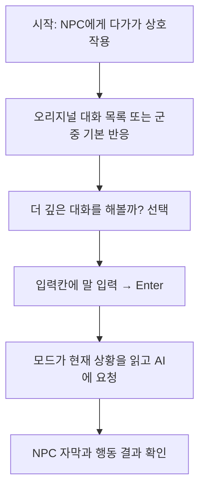

# 플레이어 행동에 따른 게임 모드 기능 명세

규격 버전: 1.3 (2026-10-08). 첫 게임판의 사용자 행동과 관찰 가능한 반응을 정의한다. 현재 구현으로 목표 기능을 축소하지 않는다. 구현·검증 상태와 남은 결함은 [개발·검증 계획](development-validation.md), 실제 배포 파일 변경·이유는 [배포 변경 이력](game-mod-validation.md)에 둔다.

## 1. 적용 범위와 기준

첫 게임판은 V가 먼저 선택한 단일 NPC와 텍스트로 대화하고, 한국어 대사 자막·일본어 NPC 음성과 행동 선택 결과를 받는 기능이다. 군중은 같은 살아 있는 개체의 생성 정체성을 유지하고, 지원 커뮤니티 인물은 오리지널 정체성·현재 관계를 따른다. 오리지널 퀘스트·친밀도·인벤토리·재화는 AI 대화로 변경하지 않는다. 자율 다중 NPC 대화·제스처 실제 재생은 후속 범위다.

타입/모듈 포트는 [공통 규격](module-interface-specification.md), 인물·거리·제어 조건은 [NPC 식별](npc-identity-specification.md), 생성 결과와 행동 권한은 [프롬프트](prompt-specification.md)/[행동](npc-action-scope.md), 기억은 [기억 규격](memory-specification.md), 비용은 [비용 규격](api-cost-specification.md)을 따른다. 이 문서는 같은 데이터 계약을 재정의하지 않는다. 분야별 규격을 바꿔야 하는 변경은 해당 기준과 함께 개정한다.

플레이어가 입력하기 전에는 모델을 호출하지 않는다. 스캔·이동·장비 변경·재접촉·메뉴 조작·실패 안내만으로 추가 유료 호출을 만들지 않는다. 한 입력의 대사와 행동은 한 생성 요청으로 받는다. 개발 진단과 웹 시제품의 모의 결과는 게임 기능의 성공 표시로 사용하지 않는다.

## 2. 사용자 흐름

**시작점은 자유 플레이 중 NPC와 상호작용하는 순간이다.** 설치·API 키 설정은 먼저 한 번 준비하는 절차이며 3절에서 다룬다. 아래는 대화가 허용된 대상의 기본 순서다.

답변을 읽은 뒤 계속 대화하면 입력 단계로 돌아간다. 대화를 종료하면 자유 플레이/오리지널 대화로 복귀한다. 진입 거부는 4절, 취소·오류는 5/8절, 이동·전투·세계 전환은 7절의 해당 행동 표를 따른다.

idle/targeting/entry_pending/handoff/active/waiting/closing의 의미는 [실행 규격 3절](runtime-specification.md#3-세션과-동시성)을 따른다. 아래의 ‘자막 차례’는 출력 단계이며 새로운 공통 상태 타입이 아니다. waiting에도 사용자가 취소/종료할 수 있어야 한다. ‘AI 응답 대기 중’ 같은 상태 문구를 게임 화면에 반복 표시하지 않는다.

## 3. 설치·실행·설정

| ID | 플레이어 행동·조건 | 모드의 반응 | 화면·검증 기준 |
| --- | --- | --- | --- |
| UF-01 | 모드 설치 | [배포 규격](mod-distribution-specification.md)의 소유 파일만 설치. 기존 파일 검사·백업 완료 후 변경 | 설치 목록·버전·의존성·복원 위치 확인 가능 |
| UF-02 | 게임 시작, 필요한 코어 도구 누락/비호환 | 해당 모드 기능 활성화를 거부하고 오리지널 플레이 보존 | 누락 항목을 설정/진단에서 안내. 임의 도구 다운로드·설치 없음 |
| UF-03 | 키 없이 게임 시작/추가 대화 시도 | 오리지널 플레이 허용, 유료 대화 시작 거부 | NPC가 서비스 오류를 말하지 않음. 키 설정 안내 |
| UF-04 | API 키 등록/삭제 | 마스킹 입력을 보안 저장소에 등록/삭제. 저장 키를 다시 출력하지 않음 | 성공/실패만 표시. 설정·ZIP·로그에 키 원문 없음 |
| UF-05 | 모델/연결/개인 비용 한도 변경 | 현재 요청 종료 또는 취소 후 적용. 지원 프로필과 예산 검사 | 자동 상위 모델 전환 없음. 미지원 모델은 사유 안내 |
| UF-06 | 개발 디버그 창(ANPC 디버그) 열기/닫기 | 버전·대화·AI·TTS 상태와 최근 음성·얼굴 처리 결과, 바라보는 NPC·원작 선택지 연결 상태 조회. 상태 코드는 한국어 이름으로 표시. 대화 시작/유료 호출·원작 선택 자동 실행 없음 | 디버그 창 없이 대화/행동 결과 동작 |

## 4. 대상 선택과 오리지널 상호작용

| ID | 플레이어 행동·조건 | 모드의 반응 | 화면·검증 기준 |
| --- | --- | --- | --- |
| UF-07 | NPC를 바라보기만 함 | 단일 대상 후보와 안전 조건만 조회 | 자동 발화·자동 채팅·유료 호출 없음 |
| UF-08 | 범위 밖/사망/비NPC/지원하지 않는 대상과 상호작용 | AI 진입을 제공하지 않음 | 오리지널 상호작용을 대체하거나 군중 카드로 고유 인물을 보충하지 않음 |
| UF-09 | 군중에게 오리지널 대화 반응 요청 | 오리지널 또는 승인된 기본 반응을 먼저 진행 | 기본 반응에는 AI 세션·호감·관찰 기억 등록 없음 |
| UF-10 | 군중 기본 반응이 끝남 | 같은 유효 개체·거리·상태에서 추가 선택지 제공 | 반응 중 중복 삽입 없음. 소멸/대상 교체 후 토큰 사용 불가 |
| UF-11 | 지원 커뮤니티 인물의 오리지널 대화 목록 열기 | 허용된 메인 대화 선택지에 추가 항목 배치. 표시 순간 거리·장면 상태로 막혔으면 목록이 떠 있는 동안 다시 확인해 통과 즉시 배치 | 오리지널 문구·순서·결과·퀘스트 플래그 보존 |
| UF-12 | 오리지널 선택지 스크롤/선택 | 오리지널 입력과 결과를 그대로 전달. ANPC 항목 선택만 가로챔 | ANPC 선택이 오리지널 항목을 동시에 실행하지 않음 |
| UF-13 | 타이머 있는 선택/시네마틱/금지 단계에 진입 | 추가 대화를 차단하고 오리지널 제어 유지 | 처음 만남/자유 구간으로 임의 대체하지 않음 |
| UF-14 | ‘더 깊은 대화를 해볼까?’ 선택 | 토큰 1회 소비, 동일 대상·세계·거리·콘텐츠/연결·진행 재검사 후 기본 제어 정책 적용 | 오리지널 반환 확인 뒤 입력칸 개방. 자유 군중은 세션 시작 즉시 정지하고 V를 바라보며(행동 규격 3절 세션 기본 제어) 세션 종료 사유와 무관하게 해제해 원래 보행으로 복귀. 대화 선택지 보류/장면 중 NPC에는 걸지 않고, 워크스팟 점유 중이면 벗어난 뒤 건다. 실패 시 정리·사유 안내 |
| UF-15 | 허용된 커뮤니티 오리지널 선택 대기 대화 선택지에서 ANPC 선택 | 타이머 없는 대화 선택지를 보류하고 오리지널 선택 입력/표시를 막음 | 오리지널 장면에 종료/선택 명령 없음. 정지·회전 행동 없음. 종료 시 오리지널 대화 선택지 복귀 |
| UF-16 | 선택 직전 다른 NPC로 시선/대상 변경 또는 오래된 항목 재선택 | 기존 토큰 폐기, 새 대상의 진입 흐름부터 검사 | 이전 NPC의 입력칸/답변으로 이어지지 않음 |

## 5. 입력·대기·출력

| ID | 플레이어 행동·조건 | 모드의 반응 | 화면·검증 기준 |
| --- | --- | --- | --- |
| UF-17 | 대화 진입 후 타이핑 | 입력칸에 포커스. 해당 키가 이동·무기·오리지널 선택에 중복 전달되지 않음 | 세계 시간은 유지. 메뉴/위험 조건 계속 감시. 열기·닫기 경계에서 키가 눌린 채 남지 않음: 이동 키가 눌려 있으면 뗄 때까지 열기를 미루고, Enter/Esc 때 입력칸이 받은 키가 남아 있으면 모두 뗀 뒤(최대 1초) 닫음 |
| UF-18 | 한글 자모·Shift 쌍자음/모음·겹받침·삭제·한/영 전환 입력 | 두벌식 조합/확정/삭제를 일관되게 처리 | 얘·예·있다·했어 등 조합 보존. Shift 자체로 조합 확정 금지 |
| UF-19 | 빈 값/공백만 Enter | 전송하지 않고 입력 유지 | 호출·자막·기억 추가 없음 |
| UF-20 | 입력 길이 한도 초과 | 첫 게임판 입력칸은 기본 200자. 제출 전에 검사·거부하고 입력을 무단 잘라 보내지 않음 | 허용 길이 안내·편집 가능. UI 입력 한도이며 생성 출력/전체 문맥 한도와 분리 |
| UF-21 | 유효 입력 Enter | 조합 확정 → 같은 대상의 현재 맥락 수집 → 요청 1건. V 발화와 서비스 상태를 분리 | 이번 입력은 한 번만 처리. 별도 행동 분류 호출 없음 |
| UF-22 | waiting에서 추가 입력/Enter 반복 | 두 번째 전경 요청을 만들지 않음 | 취소/종료는 계속 가능. 대기 문구 반복/강제 안내 없음 |
| UF-23 | waiting에서 요청 취소 | 대기 작업 취소 요청·결과 무효화, 같은 대화의 active로 복귀 | 취소된 턴의 답변/행동/기억 추가 없음. 이미 전송한 호출의 청구 취소를 보장하지 않음 |
| UF-24 | 입력/대기/자막 어느 차례에서든 대화 종료 | ANPC UI·자막·대기 작업·기본 제어 정리, 오리지널 제어 복원 | 키보드 종료/종료 조작이 모든 차례에서 가능 |
| UF-25 | 정상 답변 도착 | 현재 대상·세계·진행·관찰·응답 형식 재검사 후 NPC 대사/후속 질문 표시 | 시스템 오류·행동 설명이 NPC 자막에 섞이지 않음 |
| UF-26 | 자막 읽기/기록 다시 보기 | 확정 발화를 순서대로 보존하고 활성 기록을 열람 가능하게 함 | 자막 수명·긴 대사 분할은 [실행 규격 7절](runtime-specification.md#7-대사-자막과-게임-진행). 대기 취소/종료 조작을 막지 않음 |
| UF-27 | action=null 응답 수신 | 대사와 별도 결과 패널에 ‘추가 행동 없음’ 표시 | 추가 모델 호출·가상 실행 없음 |
| UF-28 | 허용된 제스처 선택 응답 수신 | 첫 게임판에서는 선택 의미와 실행 미지원 표시 | 끄덕임 등을 실제 재생 완료로 표시하지 않음. 자산 경로를 모델에 맡기지 않음 |
| UF-29 | 작별/대화 종료 응답 수신 | 작별 대사 뒤 세션 종료 | 예정 종료와 완료를 구분. 이전 타이머가 새 세션을 종료하지 않음 |
| UF-30 | 등록 밖 행동/잘못된 응답 수신 | [실행 규격 5절](runtime-specification.md#5-요청응답-계약)의 검증/안전 대체 정책 적용 | 임의 코드·퀘스트·아이템·재화·관계 변경 실행 없음 |
| UF-31 | 입력/UI 조작 없이 유휴 상태 유지 | 실행 규격의 active 유휴 한도에 따라 종료 | waiting을 유휴 종료로 오판하지 않음 |

## 6. NPC 정체성·플레이어 상황

| ID | 플레이어 행동·조건 | 모드의 반응 | 화면·검증 기준 |
| --- | --- | --- | --- |
| UF-32 | 스캔하지 않은 NPC와 대화 | 대상의 게임 스캔용 표시 신원을 직접 조회 | 확인된 이름·소속·역할·공개 특성만 사용. 화면을 강제로 스캔 상태로 전환하지 않음 |
| UF-33 | NPC를 직접 스캔 | 대화 진입·모델 호출을 자동 시작하지 않음 | 같은 대상의 표시값과 모드 수집값을 비교 가능. 스캔 자체로 새 성격 생성 없음 |
| UF-34 | 신원/업무/소속 정보가 없는 군중과 대화 | 승인 기본 시민 원형과 허용된 생성 범위 사용 | 가상 실명·관찰되지 않은 직업·소속·거주를 게임 사실로 보충하지 않음 |
| UF-35 | 확인된 직업/역할의 군중과 대화 | 근거와 일치하는 승인 원형/지식 적용. Big Five는 별도로 생성 | 소속만으로 직책·자격 추정 금지. 스캔 능력을 성격/행동 권한으로 환산하지 않음 |
| UF-36 | 주요 인물에게 질문 | 고정 성격·말투·원칙과 확인된 오리지널 진행/관계를 적용 | 기존 정체성/관계를 무작위로 덮어쓰지 않음. 미지원 필수 단계는 차단 |
| UF-37 | 비밀·전문 절차·오리지널 사건을 질문/주장 | 인지·분야 깊이·진행·공개 조건을 선검사 | 질문/기억/평판을 실제 퀘스트 완료나 비밀 인지로 승격하지 않음 |
| UF-38 | 복장/옷장/숨김 슬롯/외부 무장 변경 후 질문 | 현재 NPC가 관찰 가능한 실제 표시 상태만 반영 | 색·소재·숨은 장비/가방/스탯을 이름만으로 만들어내지 않음 |
| UF-39 | NPC 시야 밖에서 장비/외형 질문 | 미관찰 항목은 unknown | 이전 발화나 모델 추정으로 현재 모습을 확정하지 않음 |
| UF-40 | 평판 변화/첫 시민 접촉 | 승인 공개 이름 인지 규칙 적용 | 사용자 확정 개발 규칙은 길거리 평판 40 이상에서 V 이름만. 비밀·사적 관계와 분리 |
| UF-41 | 지역 이동/시간 경과 후 질문 | 확인된 지역명/시간대 사용 | 현재 위치를 NPC의 출신/거주로 판단하지 않음 |
| UF-42 | 응답 대기 중 신원·관찰·관계/진행 변경 | 관련 현재 조건을 재판정하고 달라진 답변 전체 폐기 | 대사/행동/기억 일부 사용 없음. 사용자 재입력 안내, 자동 유료 재생성 없음 |

## 7. 이동·전투·오리지널 제어·세계 전환

| ID | 플레이어 행동·조건 | 모드의 반응 | 화면·검증 기준 |
| --- | --- | --- | --- |
| UF-43 | 같은 NPC 근처에서 계속 대화 | 같은 세션·생성 정체성 유지 | 복장·평판·질문만으로 군중 성격/말투/선택 지식 재추첨 없음 |
| UF-44 | 대화 유지 거리 밖으로 이동 | 세션 종료·자막/대기/행동 정리 | 다른 가까운 NPC로 자동 이전하지 않음 |
| UF-45 | V 또는 대상 전투/사망·소멸·언로드 | 즉시 세션 정리, 오리지널 제어 우선 | 진행 중/늦은 응답과 후속 행동 폐기 |
| UF-46 | 대화 중 차량 탑승·플레이어 워크스팟·메뉴·시네마틱 진입 | 시작과 같은 보호 조건을 다시 적용하고 허용되지 않으면 종료 | 모델 응답이 새 상태에서 표시/실행되지 않음 |
| UF-47 | 오리지널 대화·퀘스트 제어가 시작/보류 대화 선택지가 종료 | ANPC 정리 후 오리지널에 제어 반환 | 기존 대화 선택지/플래그를 되돌리거나 강제 종료하지 않음 |
| UF-48 | 다른 NPC와 대화를 시작하려 함 | 현재 세션을 명시 종료/정리한 뒤 새 진입 검사 | 동시 전경 대화·이전 NPC 답변/기억 공유 없음 |
| UF-49 | 빠른 이동·다른 세계/플레이 기록으로 전환 | 세계 세대 갱신, 토큰·군중 생성/기억·대기·UI 정리 | 이전 요청 번호가 재사용돼도 이전 답변이 새 대상에 들어가지 않음 |
| UF-50 | 종료 뒤 같은 군중 재접촉 | [재접촉 규격](npc-identity-specification.md#3-재접촉과-기억)의 같은 유효 개체/시간/거리 조건 적용 | 같은 생성 특성·요약 재사용. 거리 이탈만으로 기억 삭제하지 않음 |
| UF-51 | 만료/재생성된 군중 또는 보관 용량 초과 | 규격에 따라 이전 생성 자료 폐기/최근 미사용부터 제거 | 같은 이름·외형·레코드여도 과거 다른 개체의 정체성 승계 금지 |

## 8. 기억·저장·서비스 오류

| ID | 플레이어 행동·조건 | 모드의 반응 | 화면·검증 기준 |
| --- | --- | --- | --- |
| UF-52 | 정상 종료/위험 중단 | 수용된 발화만 해당 인물의 로컬 세션 한 줄로 정리 | 취소/실패/미표시 응답 제외. 성격·친밀도·퀘스트 변경 없음 |
| UF-53 | 대화를 길게 이어감 | 원문/다음 요청 공간 한도를 넘기기 전에 종료·새 대화 안내 | 초과 입력으로 추가 유료 호출하지 않음 |
| UF-54 | 게임 저장 | 정확한 저장 시점의 지원 커뮤니티 기억과 수용된 세션 발화를 캡처 | 저장을 요약/API 완료까지 대기시키지 않음. 키/지출 원장은 세이브에 넣지 않음 |
| UF-55 | 과거 저장 로드 | 해당 저장 시점 자료로 교체. 미래 대사/요약·군중·대기 폐기 | 저장 대응이 불명이면 빈 기억. 다른 저장의 기억 추정 복원 없음 |
| UF-56 | 기억 삭제/모드 초기화 | 사용자가 선택한 기억 범위만 삭제하고 관련 작업 무효화 | 키·누적 비용·오리지널 저장/관계는 별도 동의 없이 초기화하지 않음 |
| UF-57 | 키 오류·네트워크·응답 시한·요금/형식 오류 | 시스템 안내와 직접 재입력/종료 제공 | 기본 자동 재시도 없음. NPC 서비스 오류 대사/가상 행동 없음 |
| UF-58 | 직접 같은 문장 재전송 | 새 요청으로 처리하고 현재 맥락 재수집 | 이전 요청의 행동을 재실행하거나 늦은 답변을 재사용하지 않음 |
| UF-59 | 개인 비용 한도에 도달 | 원장/진행 예약을 포함해 다음 요청 차단 | 게임 저장 로드로 지출을 되돌리지 않음. 불명 사용량은 0으로 표시하지 않음 |
| UF-60 | 대기 중 게임 종료/모드 종료 | 통신·UI·세션 제어 정리 | 종료 뒤 작업이 다시 게임 객체/다른 세션을 호출하지 않음 |
| UF-61 | 업데이트·되돌리기·제거 | [배포 규격](mod-distribution-specification.md)의 소유 목록/해시로 처리 | 타 모드·원본·세이브·키 보존. 사용자가 바꾼 파일을 조용히 덮어쓰거나 삭제하지 않음 |
| UF-62 | 대화 중 Tab으로 캐릭터·인벤토리 메뉴 열기/닫기 | 조합 중 한글을 확정하고 입력/커서/한영 상태를 보관한 뒤 오리지널 메뉴 경로로 전달. 메뉴 중 입력·대사/행동 표시를 보류하고, 닫은 뒤 동일 대상/세계/안전 조건과 현재 장비를 다시 검사하여 복귀 | 입력/대기/자막 차례 모두 지원. 메뉴 조작만으로 추가 모델 호출 없음. 메뉴 차단 시 입력 복귀. 전투/소멸/로드/빠른 이동 뒤 이전 대화 복귀 금지 |
| UF-63 | 인물/군중과 일상 대화·농담·도발·유혹 | 고정 인물의 욕설/은어/유머 강도와 군중의 유효한 고정 말투를 적용한다. 성인 NPC는 화제/분위기에 맞으면 먼저 비노골적 성인 농담을 건넬 수 있다 | 모든 인물을 순화하거나 같은 욕설쟁이로 만들지 않음. 현재 가치관/관계/인지 범위를 유지하며 농담으로 친밀도·경험·행동 권한을 생성하지 않음. 어린이/성인 여부 미확인은 성적 농담 제외 |

UF-62의 캐릭터·인벤토리 메뉴는 UF-17의 입력 차단과 UF-46의 메뉴 종료에 대한 명시적 예외다. 오리지널의 전투/연출 메뉴 제한을 해제하지 않는다. 메뉴에서 복장·장비를 바꾸면 대기 중 답변도 최신 상태 검사에 따라 폐기할 수 있으며 자동 재호출하지 않는다.

## 9. 외부 모션과 테스트 화면

| ID | 플레이어 행동·조건 | 모드의 반응 | 화면·검증 기준 |
| --- | --- | --- | --- |
| UF-64 | 자유 상태의 군중에게 제스처 요청 또는 일상 대화 | AMM 설치·필수 자원·정확한 리그·현재 안전 조건에 맞는 등록 참조만 한 번의 대사 요청에 제공한다. 응답 수용 직전에 다시 검사하고 ANPC 소유 임시 워크스팟으로 재생한다 | 오리지널 장면/기존 워크스팟/장비를 점유한 NPC 제외. 대상·세계·요청 변경, 메뉴, 전투, 거리 이탈 때 중단·소유 자원 정리. 시간 만료를 재생 성공으로 표시하지 않음. 행동 실패가 이미 수용한 대사를 지우지 않음 |
| UF-65 | 테스트 웹에서 응답 확인 | 각 대사 아래 선택한 행동의 의미와 당시 결과를 표시한다. null이면 행동 없음 | 선택 전용과 모의 실행을 실제 게임 실행과 구분. 다음 입력이나 종료로 이전 기록의 행동이 바뀌지 않음 |
| UF-74 | 커뮤니티 인물·군중과 대화 중 NPC 대사 수신 | 응답 emotion을 원작 얼굴 표정(FacialReaction)으로 옮겨 첫 음성 또는 자막과 함께 적용한다. 몸·위치·워크스팟·장비는 바꾸지 않는다 | 대화 종료·세계 전환·초기화 때 ANPC가 건 표정만 되돌린다. 안전 조건(전투·사망·거리 등) 불충족이나 적용 실패는 대사·행동에 영향 없음. 메뉴 보류 중 적용하지 않음 |

AMM 연동 범위는 서서 하는 대화 제스처 18종이다(손 흔들기·박수·회상 대화·끄덕임·고개 저음·화내며 거절·으쓱·진정시키기·긴장해 말리기·저리 가·되묻기·됐다는 손짓·설명·이마 짚기·엄지·한숨·목 긁기·환호). 끄덕임·으쓱은 의자/바 의존이 없는 서기 자세(2h_on_hip) 동작을 쓴다. 고유 NPC의 오리지널 장면 중 모션 전환은 후속 실증 범위다.

## 10. NPC 음성

참조 선택·합성·중단·설정·오류의 기준은 [음성 출력 규격](npc-voice-output-specification.md)이다.

| ID | 플레이어 행동·조건 | 모드의 반응 | 화면·검증 기준 |
| --- | --- | --- | --- |
| UF-67 | 음성이 활성화된 상태로 게임 시작 | TTS 엔진·기본 모델을 비동기로 로드하고 예열. 실패하면 이번 게임 세션의 음성을 비활성화하고 진단에 안내 | 로드 중에도 게임 진행·대화 가능. 로드 전 대사는 자막만. 음성 실패가 대화 진입을 막지 않음 |
| UF-68 | 정상 답변 도착 | UF-25 검사 통과 후 emotion으로 참조 음성을 고르고 speech_text를 스트리밍 합성해 끊기지 않을 만큼 버퍼링한 뒤 재생. 첫 음성 재생과 함께 자막 표시 | 대기 상한까지 준비된 음성 조각이 없거나 합성 실패면 자막만. 자막 뒤 늦은 음성 재생 없음. 폐기 응답의 음성 없음. V 음성 없음 |
| UF-69 | NPC 음성 재생 중 다음 입력 제출·요청 취소·대화 종료 | 현재 재생과 남은 합성을 중단하고 큐를 비움 | 이전 대사 음성이 새 대사와 겹치지 않음 |
| UF-70 | 재생 중 거리 이탈·대상 변경·전투·로드·빠른 이동·오리지널 제어 시작 | UF-44~UF-49와 함께 즉시 중단·폐기 | 늦게 끝난 합성 결과를 재생하지 않음. 오리지널 음성과 겹치지 않음 |
| UF-71 | 재생 중 UF-62 메뉴 열기/닫기 | 메뉴 중 재생 일시정지. 닫은 뒤 재검사를 통과하면 이어서 재생, 실패하면 폐기 | 메뉴 조작으로 재합성·추가 모델 호출 없음 |
| UF-72 | 참조 음성이 없는 인물 또는 군중과 대화 | 커뮤니티는 다른 목소리로 대체하지 않고 자막만. 군중은 생성 시 배정한 목소리를 쓰고, 배정이 없으면 자막만 | 같은 군중 개체는 재접촉 동안 같은 목소리. 고유 인물에게 군중 목소리 사용 금지 |
| UF-75 | 커뮤니티 인물·군중이 ANPC 음성 대사를 말하는 동안 | 첫 음성 재생과 함께 입모양(말하는 얼굴 애니메이션)을 시작하고 마지막 음성 구간이 끝나거나 중단될 때 멈춘다. 말하는 중 쉼(0.2초 이상)에는 입을 닫는다. 감정 표정(UF-74)과 겹치면 입모양을 우선한다 | 음성 없이 자막만인 대사에는 입을 움직이지 않음. 재생 중단(UF-70·71) 때 함께 멈춤. 입모양은 발음과 맞추지 않고 음성의 시작·끝에 맞춘 자연스러운 말하기 움직임이다 |
| UF-73 | 음성 끄기/켜기·음량 변경 | 현재 대사 재생 후 적용. 끄면 다음 요청부터 일본어 음성 대사를 생성하지 않음 | 음성 설정 변경으로 대화 세션·기억이 초기화되지 않음 |

## 11. 명세 기반 변경과 수용

UF-66: 오리지널 선택·퀘스트·관계·비밀 인지의 게임 파일 매핑. 선택지의 장면/노드/옵션 식별자와 실제로 기록되는 fact·일지 상태를 구분한다. 현재 지원 인물 12명의 렐릭/조니/진단/치료 인지, 친구·연인·단절·생존 분기, 본편/확장의 개별 퀘스트 상태를 독립적으로 판정한다. 파일 버전·설정/검사 노드·값·선행 조건 근거를 남기며 정적 파일 확인과 실게임 검증을 구분한다. fact=0 또는 퀘스트 제목만으로 비공개·미선택·관계 없음·미래 인지를 확정하지 않는다. 게임에 남지 않은 선택 이력은 unknown으로 처리하고 ANPC 질문/기억으로 대체하지 않는다. 사실 수집은 읽기 전용이며 원본 fact/일지/선택을 변경하지 않는다.

1. 변경할 UF ID와 해당 분야 규칙을 먼저 명시한다. 신규 사용자 행동은 ID를 추가한다.
2. [개발·검증 계획 2절](development-validation.md#2-출시-전-남은-결함)에 현재 동작·결함·검증 방법·출시 차단 여부를 기록한다. 목표 동작을 현재 코드에 맞춰 조용히 낮추지 않는다.
3. 해당 행동과 실패/취소/이전 상태 경계를 재현하는 검사로 구현한다. 공통 계약 변경은 스키마/등록표/예시를 함께 갱신한다.
4. 로컬 자동 검사, 실제 API 검사, 실제 게임 관찰을 별도로 기록한다. 하나의 성공을 다른 단계의 성공으로 표시하지 않는다.
5. 검증한 소스/패키지/설치 파일의 해시와 영구 백업을 남긴다. 첫 공개 배포는 지원 대상의 필수 UF와 배포 규격 수용 후에만 허용한다.

세부 수치·행동 후보·모델 출력 필드는 기준 문서/등록표에서 참조한다. 사용자 요구로 기준이 달라지는 경우 변경된 규칙과 영향을 함께 기록한다.
